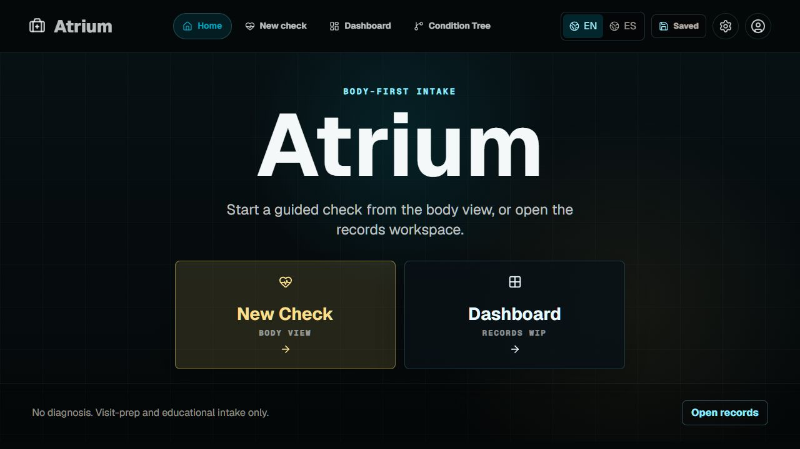
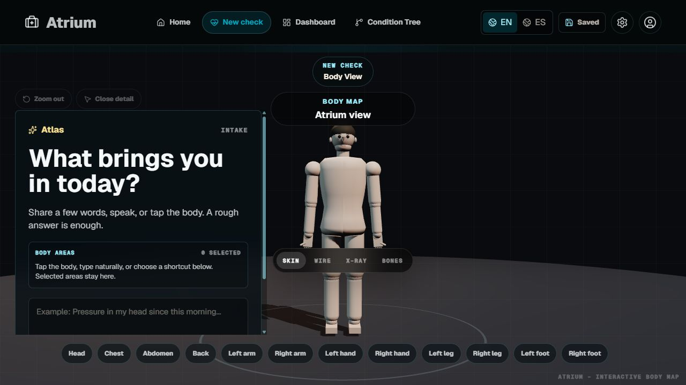
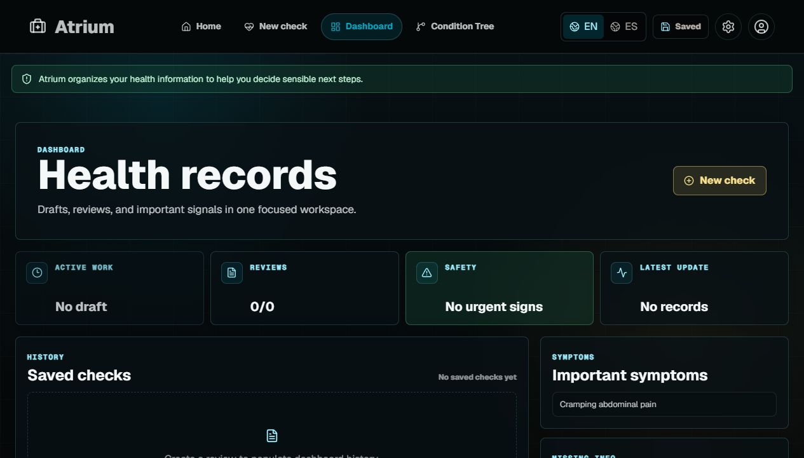
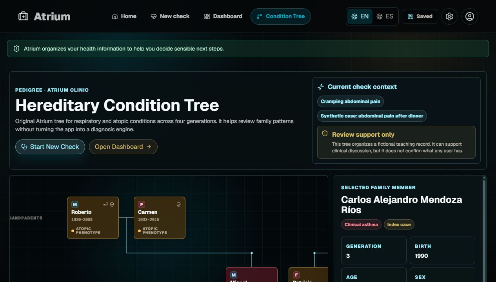

# Atrium

Atrium is a body-first healthcare intake prototype. It combines a 3D body view, guided CopilotKit questions, persistent check history, a primary review screen, and an inherited-condition tree into one fast clinical workspace.

It is built for visit preparation, education, and structured symptom capture. It is not a diagnosis engine, emergency triage product, or substitute for professional medical care.



## Why Atrium

Most symptom checkers start with a form. Atrium starts with the body.

Users can type naturally, speak, or click a body area first. The app then keeps the interaction inside the visual body view, asks only a bounded number of focused questions, stores the check locally, and turns the session into a review that can be revisited after refresh.

## Product Highlights

- Body-first intake with an interactive Three.js model
- CopilotKit-guided questions with multiple-choice answers and an open response path
- Guardrails for unrelated input, repeated questions, and runaway loops
- Optional detail dropdowns so users are not overwhelmed
- Persistent local checks and final reviews
- Dashboard for saved records, important symptoms, and safety status
- Atrium-style hereditary condition tree for family pattern review
- English and Spanish shell support
- Medical visual system with dark clinical surfaces, cyan focus states, and warm review accents

## Screenshots

### New Check

The intake starts in the body view. Users can describe what is happening, select a body area, or use shortcuts.



### Dashboard

Saved checks and final reviews stay available after refresh, with a focused records workspace.



### Condition Tree

The condition tree adapts the original Atrium pedigree view into a tree-first workspace for inherited respiratory and atopic pattern review.



## Tech Stack

- Next.js App Router
- React
- TypeScript
- CopilotKit
- Three.js with `@react-three/fiber` and `@react-three/drei`
- Local browser storage for persisted checks
- Gemini-compatible provider routing through Google Studio or OpenRouter

## Requirements

- Node.js 20 or newer
- npm 10 or newer
- Optional: a Google Studio Gemini key or OpenRouter key for live AI responses

## Install

### Windows

Use PowerShell:

```powershell
git clone <your-repo-url>
cd AiThinkers
npm ci
Copy-Item .env.example .env.local
npm run dev
```

Open [http://localhost:3000](http://localhost:3000).

If port `3000` is already in use, Next.js will offer another local port.

### macOS

Use Terminal:

```bash
git clone <your-repo-url>
cd AiThinkers
npm ci
cp .env.example .env.local
npm run dev
```

Open [http://localhost:3000](http://localhost:3000).

### Linux

Use your terminal:

```bash
git clone <your-repo-url>
cd AiThinkers
npm ci
cp .env.example .env.local
npm run dev
```

Open [http://localhost:3000](http://localhost:3000).

## Environment Variables

Atrium can run with deterministic fallback behavior when no AI key is configured, but live CopilotKit AI responses need one provider.

Google Studio:

```env
GOOGLE_API_KEY=
GEMINI_API_KEY=
GEMINI_MODEL=gemini-3.1-flash-lite
```

OpenRouter:

```env
OPENROUTER_API_KEY=
OPENROUTER_MODEL=google/gemini-3.1-flash-lite
OPENROUTER_SITE_URL=http://localhost:3000
OPENROUTER_APP_NAME=Atrium
```

Google Studio takes priority when both Google and OpenRouter keys are present.

## Production Deploy

This project includes a Docker Compose setup for a DigitalOcean VPS:

- `app` builds the Next.js standalone server and runs it with PM2.
- `caddy` terminates HTTPS and reverse-proxies traffic to the app.
- `.env.production` stores the production domain and AI provider keys.

On the VPS:

```bash
git clone <your-repo-url>
cd AiThinkers
cp .env.production.example .env.production
nano .env.production
docker compose up -d --build
```

In `.env.production`, set:

```env
DOMAIN=your-namecheap-domain.com
OPENROUTER_SITE_URL=https://your-namecheap-domain.com
```

Then point the Namecheap DNS `A` record for the domain or subdomain to the DigitalOcean droplet IP. Once DNS resolves to the droplet and ports `80` and `443` are open, Caddy requests and renews HTTPS certificates automatically.

Useful production commands:

```bash
docker compose ps
docker compose logs -f app
docker compose logs -f caddy
docker compose pull
docker compose up -d --build
docker compose down
```

## Scripts

```bash
npm run dev
npm run lint
npm run build
npm run start
```

Optional Remotion scripts are available for presentation work:

```bash
npm run video
npm run video:still
npm run video:render
```

## App Flow

1. Open Atrium.
2. Choose `New Check` or `Dashboard`.
3. In `New Check`, describe the concern or click the body.
4. Answer focused Atlas questions.
5. Review the primary summary.
6. Continue the review for more detail when needed.
7. Return later through `Dashboard` or explore `Condition Tree`.

## Safety Positioning

Atrium is designed for structured intake and review support. It should not claim to diagnose conditions, replace clinicians, or handle emergencies.

Use clear safety language in demos and marketing:

- For emergencies, users should contact local emergency services.
- Final reviews are summaries of what the user reported.
- The condition tree is an educational reference view.
- AI output is bounded by deterministic safety and question-flow rules.

## Launch Positioning

One-line pitch:

> Atrium turns symptom intake into a visual, body-first conversation that users can complete, review, and revisit.

Audience:

- healthcare hackathon judges
- clinical innovation teams
- digital health product builders
- AI UX researchers
- patient-intake workflow designers

Differentiators:

- visual body-first entry instead of a generic form
- bounded AI flow instead of open-ended chat
- persisted review history instead of disposable conversations
- condition tree support without diagnostic overreach

## Social Copy

LinkedIn post:

```text
Most healthcare intake tools still feel like paperwork with a chatbot attached.

Atrium takes a different route:

- start from the body, not a form
- let users type, speak, or select an area
- ask bounded follow-up questions
- persist the final review
- keep family-pattern context in a visual condition tree

The goal is not to diagnose. It is to make visit preparation clearer, calmer, and easier to revisit.
```

Short X/Twitter post:

```text
Building Atrium: a body-first healthcare intake prototype.

Users start with a 3D body view, answer bounded CopilotKit questions, and get a persistent review they can revisit later.

Not a diagnosis engine. A better front door for symptom context.
```

Demo caption:

```text
Atrium replaces the blank medical form with a visual intake flow: click the body, answer focused questions, review the summary, and keep the record.
```

## Project Structure

```text
src/app
  api/                  API routes for CopilotKit and generated guidance
  page.tsx              Query-driven app entry

src/components
  app-shell/            Navigation, view routing, and shell state
  body-view/            3D body-first intake experience
  condition-tree/       Atrium hereditary tree workspace
  dashboard/            Saved checks and review history
  review/               Primary review experience

src/lib
  ai-provider.ts        Google/OpenRouter provider selection
  check-storage.ts      Local persistence
  condition-tree.ts     Pedigree data and metadata
  intake-guardrails.ts  Question bounds and safety behavior
```

## Development Notes

- Treat `AtriumOriginalCode - copia` as read-only source reference.
- Keep the navbar shared across Home, New Check, Dashboard, and Condition Tree.
- Keep the body model and tree interactions visually primary.
- Avoid medical claims that imply diagnosis or emergency clearance.
- Prefer modular changes in `src/components` and deterministic helpers in `src/lib`.

## License

Add the intended license before public release.
